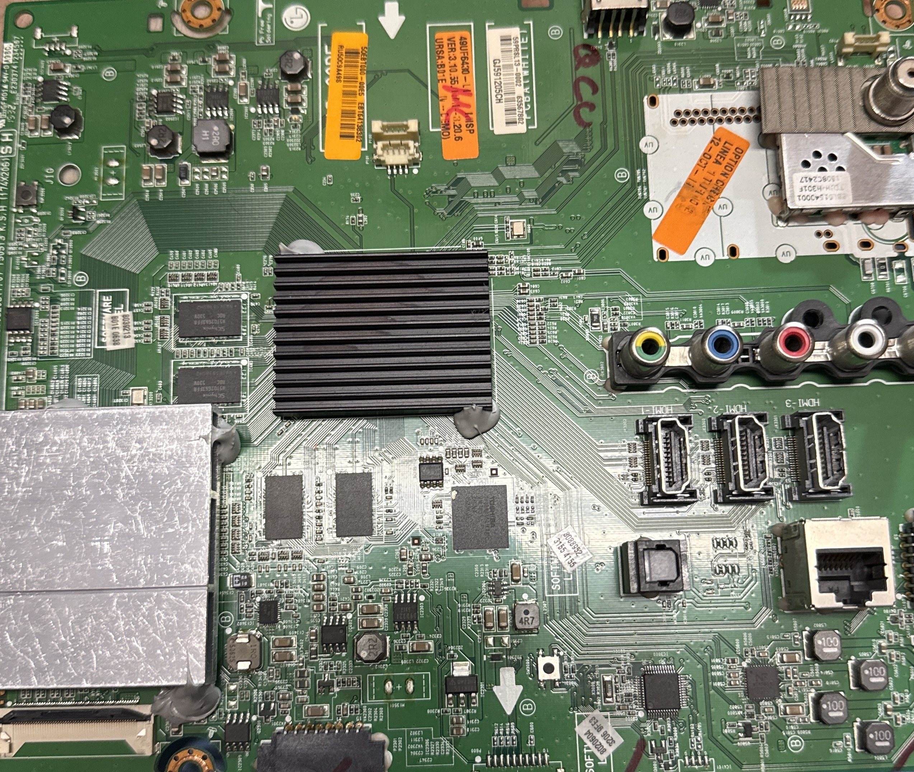
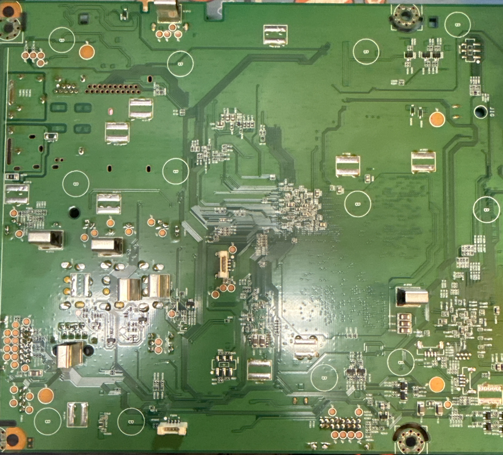

# LG 49" 4k TV

## Why?

It was a gift from my late father and the screen itself was fine.

## Inside at a Glance
- PSU
- Mainboard
- T-Conn

## Worth Voiding?
Depends on what's broken.  In my case, the TV still booted find and the screen had a sharp picture on the internal menus and apps.  Any video source produced colorful noise though.

## Notes
Best you can hope to accomplish is identifying which board is damaged and order a replacement.  In my case, one of the processors failed and there was no way to replace it without replacing the whole board.  Waiting on replacement board to arrive.

## Images

